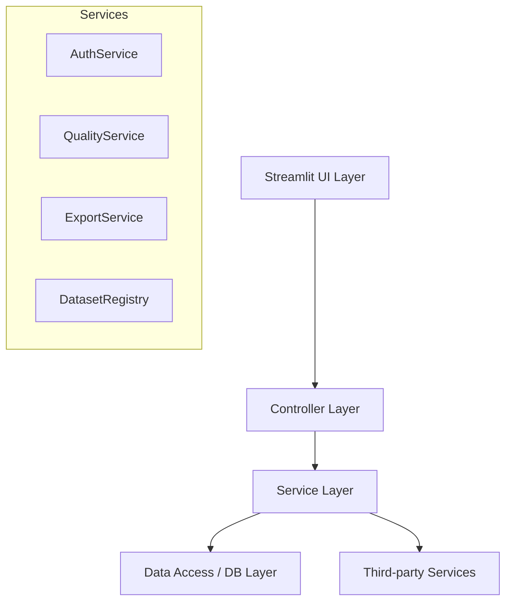

# 📊 Analytical Platform Pro


[](https://www.python.org/)
[](https://streamlit.io/)
[](LICENSE)
[](#security)

**Analytical Platform Pro** — это комплексное решение для профессионального анализа, визуализации и аудита качества данных. Построенное на базе Streamlit и современных инженерных паттернов, приложение предоставляет инструменты уровня SaaS для работы с табличными данными в реальном времени.

---

## 🎯 Ключевые возможности

| Модуль | Описание |
| :--- | :--- |
| **📁 Interactive Table** | Исследование данных с мощной фильтрацией, глобальным поиском и динамическим отображением. |
| **🎯 Data Quality** | Глубокий аудит датасетов: поиск пропусков, дубликатов, выбросов и структурных ошибок с расчетом Quality Score. |
| **🛠️ Dashboard Builder** | Визуальный конструктор графиков (Bar, Line, Scatter, Pie и др.) с сохранением состояния в БД. |
| **🔄 Dataset Comparison** | Статистическое сравнение двух версий данных, выявление изменений в структуре и значениях. |
| **📤 Upload Data** | Динамическая загрузка и регистрация новых CSV-файлов без перезагрузки кода. |
| **🔐 Secure Export** | Экспорт защищенных Excel (Formula Injection Protection) и PDF отчетов. |

---

## 🏗️ Архитектура проекта

Приложение следует принципам **Clean Architecture** и **Service-Oriented Design**, что обеспечивает масштабируемость и легкость тестирования.



---

## 🛠️ Технологический стек

- **Core:** Python 3.13+, Pandas, NumPy, SciPy
- **UI:** Streamlit, Plotly, Matplotlib
- **Security:** Bcrypt, SQL Injection Protection, Formula Injection Sanitization
- **Reports:** Sweetviz, FPDF2, Openpyxl
- **Database:** SQLite3

---

## 🚀 Быстрый старт

### 1. Установка окружения
```bash
# Клонирование репозитория
git clone https://github.com/your-repo/analytical-platform-pro.git
cd analytical-platform-pro

# Создание виртуального окружения
python -m venv .venv
source .venv/bin/activate  # Windows: .venv\Scripts\activate

# Установка зависимостей
pip install -r requirements.txt
```

### 2. Инициализация базы данных
Перед первым запуском необходимо создать базу данных и пользователя:
```bash
python init_database.py
```
> **Default Access:** `admin` | `admin123`

### 3. Запуск приложения
```bash
streamlit run streamlit_app.py
```

---

## 📂 Структура проекта

```text
├── app/
│   ├── services/     # Бизнес-логика (Auth, Export, Quality, etc.)
│   ├── reports/      # Генерация HTML и PDF отчетов
│   ├── models/       # Типизированные структуры данных
│   ├── ui/           # Компоненты интерфейса
│   └── config.py     # Глобальные настройки путей
├── data/             # Наборы данных (FIFA, Movies, Powerlifting)
├── docs/             # Техническая документация
├── html_reports/     # Сгенерированные аналитические отчеты
├── streamlit_app.py  # Точка входа веб-приложения
└── users.db          # База данных пользователей и виджетов
```

---

## 🛡️ Безопасность

- **Аутентификация:** Хеширование паролей с использованием `bcrypt`.
- **Excel Protection:** Автоматическая защита от Formula Injection (префиксация спецсимволов `'`).
- **Data Isolation:** Виджеты дашбордов привязаны к конкретному пользователю в БД.
- **Path Sanitization:** Валидация путей при загрузке новых датасетов.

Для подробностей см. [SECURITY.md](docs/SECURITY.md).

---

## 🗺️ Roadmap

- [ ] Интеграция с SQL базами данных (PostgreSQL/MySQL).
- [ ] Расширенный модуль ML-прогнозирования.
- [ ] Экспорт дашбордов в интерактивный HTML-формат.
- [ ] Поддержка многопользовательского редактирования одного дашборда.

---

© 2026 Analytical Platform Pro. Разработано профессионалами для профессионалов.
