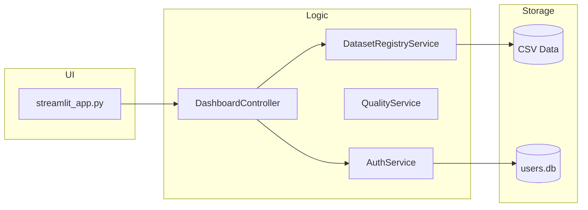

# 📘 PROJECT_DOCUMENTATION.md

## 1. Архитектура приложения

Приложение построено на базе многослойной архитектуры (Layered Architecture), обеспечивающей четкое разделение ответственности.

### Слои:
1. **Frontend Layer (Streamlit)**: Обработка пользовательского ввода, рендеринг компонентов и визуализация данных с использованием Plotly.
2. **Controller Layer**: [app/controllers/dashboard_controller.py](app/controllers/dashboard_controller.py) — мост между UI и бизнес-логикой.
3. **Service Layer**: Инкапсуляция всей логики обработки данных, аутентификации и экспорта.
4. **Data Layer**: Работа с CSV-файлами и реляционной базой данных SQLite.

---

## 2. Ключевые Сервисы

### `AuthService`
- **Назначение**: Управление учетными записями пользователей и их персональными настройками.
- **Основные методы**:
    - `verify_user(username, password)`: Аутентификация через bcrypt.
    - `get_user_widgets(username)`: Загрузка персонального дашборда.
- **База данных**: Используется SQLite. Схема инициализируется автоматически при первом обращении, но рекомендуется использовать [init_database.py](init_database.py).
- **Зависимости**: `sqlite3`, `bcrypt`.

### `ExportService`
- **Назначение**: Генератор защищенных отчетов.
- **Безопасность**: Реализует префиксацию ячеек для защиты от Formula Injection в Excel.
- **Основные методы**:
    - `to_excel()`: Генерация .xlsx с защитой данных.
    - `quality_report_to_pdf()`: Создание PDF с использованием MultiCell для обработки длинных строк.

### `QualityService`
- **Назначение**: Анализ качества входных данных.
- **Логика**: Вычисляет "Quality Score" на основе пропусков, дубликатов, константных колонок и статистических выбросов (IQR).

---

## 3. Поток данных (Data Flow)

1. **Инициализация**: [app/services/dataset_registry_service.py](app/services/dataset_registry_service.py) читает [datasets_config.json](datasets_config.json) для обнаружения доступных источников.
2. **Анализ**: [app/services/metadata_service.py](app/services/metadata_service.py) автоматически классифицирует колонки на категориальные, числовые и временные.
3. **Визуализация**: Пользователь выбирает параметры в архитектуре **Dashboard Builder**, данные проходят через [app/services/query_service.py](app/services/query_service.py) для фильтрации и передаются в Plotly.

---

## 4. Паттерны проектирования
- **Service Pattern**: Вынос бизнес-логики в отдельные классы-сервисы.
- **Repository Pattern**: Абстракция над доступом к данным через Registry Service.
- **Registry Pattern**: Динамическая регистрация новых датасетов без изменения кода.
